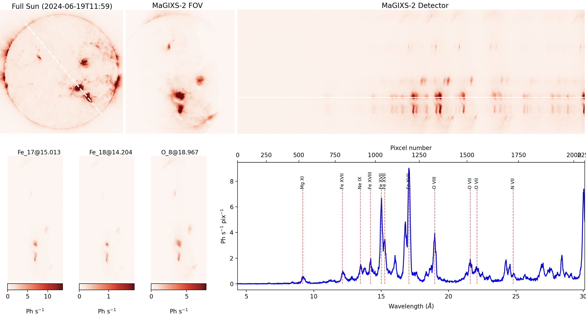

# SunX_overlappograms

Package to simulate the overlappograms from emission measure cube 



## Install

To install the package and dependencies,
```shell
$ git clone https://github.com/biswajitmb/SunX_overlappograms.git
$ cd SunX_overlappograms
$ pip install -r requirements.txt
$ pip install .
```

## Usage

This example will show how to create synthetic overlapograms using SunX_overlappograms.

Required file:

   1) An EM distribution

   2) Instrument response function

      a fits file:

                primaty hdu - image_array [wvl,FA,logT]

                secondary hdu - table_array [INDEX,LogT]

                third hdu - table_array [INDEX, FIELD_ANGLE]

```python
import fwd as fd
import os, glob
import numpy as np
from scipy.io import readsav
from astropy.io import fits
import ipywidgets as widgets
import matplotlib.pyplot as plt
```

Read EM file

```python
EM_file = 'DEM/original/sparse_ObsDEM_AIA_XRT_dem_20240716T1900.pkl'
em = fd.util.load_obj(EM_file[0:-4])
EM_map = em['EMmap'] # in 1.0e26 cm-5
dem_logt = em['logt']
ref_map = em['ref_map'] #Sunpy map object
FullSun_img_data = np.nan_to_num(ref_map.data)  # Replace NaNs with 0 from the ref_map.data
```

Call forward model 'fwd' class.

```python
m = fd.fwd(EM_map,dem_logt,ref_map)
```

Run forward model routine and select instrument FOV by drawing on axis line on the full-sun image using mouse cursore.
Each line represent a FOV and simulate detector for each FOV and store them in a fits file.

```python
MaGIXS_resp = '/Users/bmondal/BM_Works/MaGIXS/MaGIXS_2/Model/rsp/combined_Chianti/Combined_chspec_rsp_asplund_dFA0.1.fits'
resp_unit = 'electron' #unit of the response elements
Vigneting_func_file = None #If not included in response function this can be provided by a file, otherwise no vigneting as a function of FA.
IncludePoisonNoise = True #include poison noise to the synthetic detector
NoFrames = 10 #number of synthetic detector frames.
IncludeDetecorNoise = True #include readout noise
detector_noise_file = '/Users/bmondal/BM_Works/MaGIXS/ForwardModel/example/magixs_resp/darks_for_biswajit.sav'
detector_noise = readsav(detector_noise_file)['data'][4,:,:] #in the unit of electron or photon. 
phot2elec_conv_file = 'phot2elec_conv_FA0.dat' #If response is in electron, it needs to be converted in photon to estimate the photon noise. 
                                               #This is an ASCII file with 2-columns. 1st column detector pixcel and 2nd column is the 
                                               #electron to photon conversion.

pointing_info_file = None #If provoded then instrument FOV will be read from this file.
plate_scale = 2.8 #detecor plate-scale
exposure = 1.3 #exposure time
psf = 17 #in arcsec
cmap = 'hot' #color map for plotting

#Outputs
StoreOutputs = True
OutDir = 'outputs'
namestr = 'MaGIXS2_single'
SavePlot = True

StoreRawDetector = False #If True, raw detector will be stored.
RawDetectorDim = [1040,2152] #Dimension of raw detector
NonActivePix = [50, 8,4] #read/dummy pixcels at left-right, top-bottom, and middle

line_label = ['Mg XI','Fe XVII','Ne IX','Fe XVIII','Fe XVII','Fe XVII','Fe XVII','O VIII','O VII','O VII', 'N VII']
line_wvl = [9.17,12.12,13.45,14.20,15.01,15.26,17.05,18.97,21.60,22.1,24.78]

m.magixs_fwd(FullSun_img_data,MaGIXS_resp,pix2wvl=None,exposure = exposure,
        resp_unit = resp_unit, plate_scale = plate_scale, Vigneting_func_file = Vigneting_func_file,
        psf = psf,line_label = line_label,line_wvl = line_wvl,cmap='hot',
        StoreRawDetector = StoreRawDetector, RawDetectorDim=RawDetectorDim,
        NonActivePix=NonActivePix, IncludePoisonNoise=IncludePoisonNoise,
        IncludeDetecorNoise=IncludeDetecorNoise, detector_noise=detector_noise,
        phot2elec_conv_file=phot2elec_conv_file, StoreOutputs=StoreOutputs, OutDir=OutDir,namestr = namestr,
        pointing_info_file = pointing_info_file,SavePlot=SavePlot, NoFrames = NoFrames)
```


Make average data of all frames

```python
Overlappogram_file = os.path.join(OutDir,namestr+'FWDmodel.fits')
m.make_average_detector(Overlappogram_file,os.path.join(OutDir,'MaGIXS2_Average_FWDmodel.fits'))
```

Plot average data

```python
EMin_file = os.path.join(OutDir,namestr+'EMcubeInput.fits')
Overlappogram_file = os.path.join(OutDir,namestr+'FWDmodel.fits')
m.plot_detector(ref_map,Overlappogram_file,EMin_file,cmap='hot',line_label=line_label,line_wvl=line_wvl,FOV = 1, unit= 'photon', FrameRange = [0,1])
```
